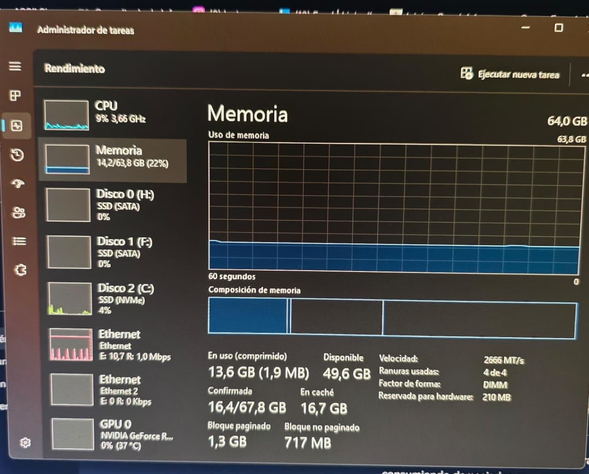

# Optimizar-RAM-Windows
Optimización de RAM en Windows liberando 5gb de RAM en Sistema
# 🖥️ Optimización de RAM en Windows

Este documento explica cómo desactivar **SysMain** y **Prefetch** para liberar hasta 5 GB de memoria RAM en sistemas con SSD/NVMe.  
Incluye capturas de pantalla del **Administrador de tareas** antes y después del ajuste.

Comando para ingresar rapido a revisar monitoreo del sistema 
**Presionar Win + R → escribir services.msc**

> Atención: este cambio solo es recomendable si usás SSD/NVMe.

---

### Estado inicial (Antes del ajuste)

- Memoria total: 64 GB  
- Uso actual: 22% (14.2 GB)  
- Procesos activos: SysMain y Prefetch habilitados  
- **Observación:** consumo elevado de memoria caché.

---

## 🛠️ Paso 1 – Desactivar Prefetch
1. Abrir **Editor de Registro** (`Win + R` → `regedit`).  
2. Ir a:  

**HKEY_LOCAL_MACHINE\SYSTEM\CurrentControlSet\Control\Session Manager\Memory Management\PrefetchParameters**

3. Cambiar el valor `EnablePrefetcher` a **0**.  
4. Guardar y cerrar.

---

## 🛠️ Paso 2 – Desactivar SysMain
1. Abrir **Servicios** (`Win + R` → `services.msc`).  
2. Buscar **SysMain**.  
3. Clic derecho → **Detener**.  
4. En tipo de inicio → **Deshabilitado**.  

---

## 🔄 Paso 3 – Reiniciar el sistema
- Reiniciar la PC para aplicar los cambios.  
- Verificar en el Administrador de tareas que SysMain ya no aparece activo.

---

## 📊 Estado final (Después del ajuste)

- Memoria total: 64 GB  
- Uso actual: 17% (10.8 GB)  
- Procesos activos: SysMain y Prefetch deshabilitados  
- **Observación:** se liberaron ~3–5 GB de RAM.

---

## ✅ Conclusión
Este ajuste es recomendable en equipos con **SSD/NVMe**, ya que los servicios de precarga no aportan beneficios y consumen memoria innecesaria.  
En discos mecánicos (HDD) puede afectar la velocidad de inicio, por lo que no se recomienda.

---

## 📌 Referencias
- **[SysMain](ca://s?q=Que_es_SysMain_en_Windows)**  
- **[Prefetch](ca://s?q=Que_es_Prefetch_en_Windows)**  
- **[Administrador de tareas](ca://s?q=Interpretar_pesta%C3%B1a_Rendimiento_en_Administrador_de_Tareas)**

Repaso por si nos perdimos algo. 
01
Abrir el Editor de Registro
Necesario para desactivar Prefetch desde el sistema.

Presionar Win + R → escribir regedit

Navegar a: HKEY_LOCAL_MACHINE\SYSTEM\CurrentControlSet\Control\Session Manager\Memory Management\PrefetchParameters

Cambiar el valor EnablePrefetcher a 0

Guardar y cerrar

02
Desactivar SysMain
Este servicio precarga aplicaciones en RAM, pero en SSD/NVMe no aporta beneficios.

Presionar Win + R → escribir services.msc

Buscar SysMain

Clic derecho → Detener

En tipo de inicio → seleccionar Deshabilitado

03
Reiniciar el sistema
Aplicar cambios
El reinicio asegura que los servicios deshabilitados no vuelvan a cargarse.

Reiniciar la PC

Abrir Administrador de tareas → pestaña Rendimiento

Verificar que SysMain ya no aparece activo

