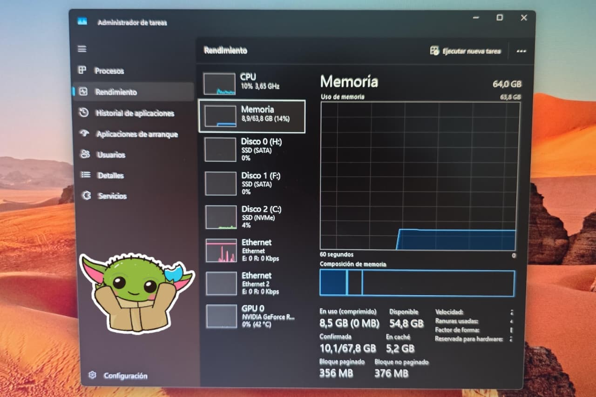
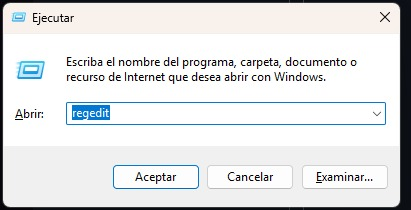
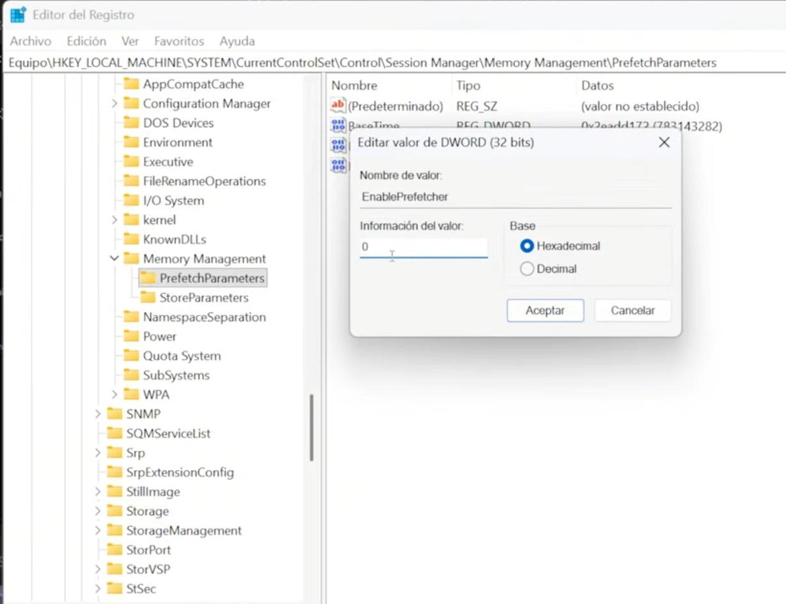
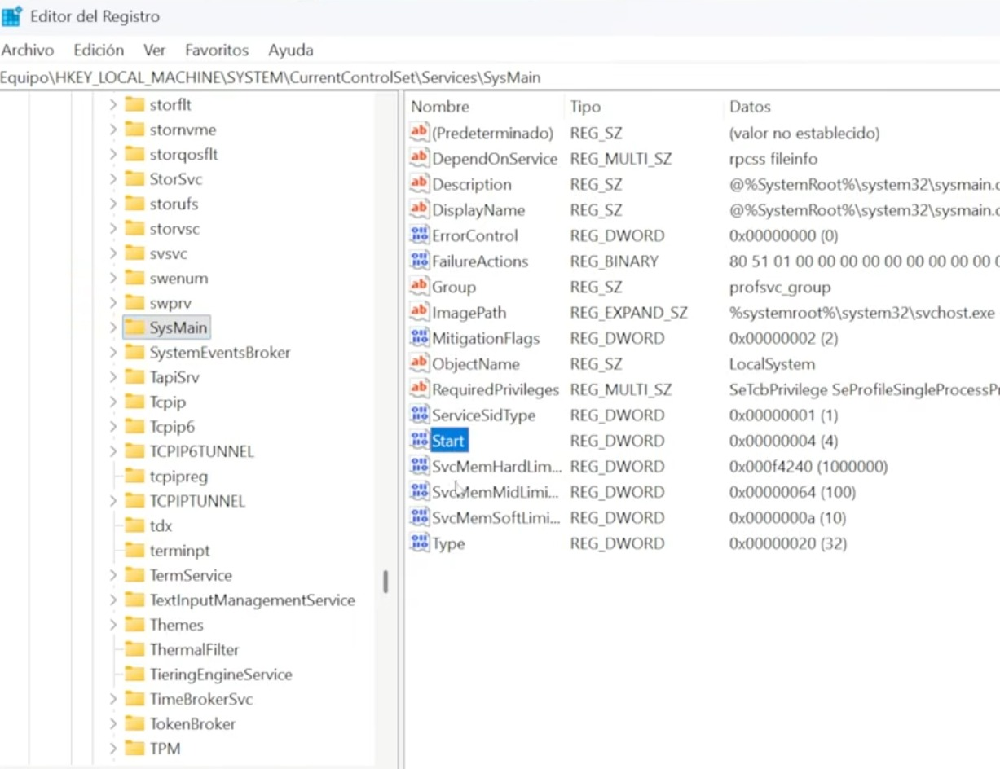
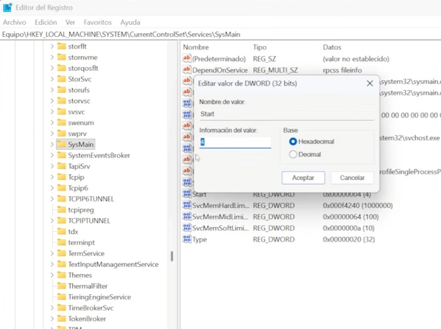

# Optimizar-RAM-Windows
Optimización de RAM en Windows liberando 5gb de RAM en Sistema
# 🖥️ Optimización de RAM en Windows

Este documento explica cómo desactivar **SysMain** y **Prefetch** para liberar hasta 5 GB de memoria RAM en sistemas con SSD/NVMe.  
Incluye capturas de pantalla del **Administrador de tareas** antes y después del ajuste.

Comando para ingresar rapido a revisar monitoreo del sistema 
**Presionar Win + R → escribir services.msc**

### 🛠️ Cómo desactivarlos (paso a paso)

> Atención: este cambio solo es recomendable si usás SSD/NVMe.

---

### Estado inicial (Antes del ajuste)

### Estado inicial (despues)

| **Estado** | **Uso RAM** | **RAM disponible** | **Caché** | **CPU** | **Beneficio** |
| --- | --- | --- | --- | --- | --- |
| **[Antes](ca://s?q=RAM_antes_del_ajuste_en_Windows)** | 14.2 GB (22%) | 49.6 GB | 16.7 GB | 9% | Consumo elevado en caché |
| **[Después](ca://s?q=RAM_despues_del_ajuste_en_Windows)** | 8.9 GB (14%) | 54.8 GB | 5.2 GB | 9% | Se liberaron ~5 GB de RAM |

- Memoria total: 64 GB  
- Uso actual: 22% (14.2 GB)  
- Procesos activos: SysMain y Prefetch habilitados  
- **Observación:** consumo elevado de memoria caché.

---

## 🛠️ Paso 1 – Desactivar Prefetch
1. Abrir **Editor de Registro** (`Win + R` → `regedit`).  
2. Ir a:  

**HKEY_LOCAL_MACHINE\SYSTEM\CurrentControlSet\Control\Session Manager\Memory Management\PrefetchParameters**

3. Cambiar el valor `EnablePrefetcher` a **0**.  
4. Guardar y cerrar.

---

## 🛠️ Paso 2 – Desactivar SysMain
1. Abrir **Servicios** (`Win + R` → `services.msc`).  
2. Buscar **SysMain**.  
3. Clic derecho → **Detener**.  
4. En tipo de inicio → **Deshabilitado**.  

---

## 🔄 Paso 3 – Reiniciar el sistema
- Reiniciar la PC para aplicar los cambios.  
- Verificar en el Administrador de tareas que SysMain ya no aparece activo.

---

## 📊 Estado final (Después del ajuste)

- Memoria total: 64 GB  
- Uso actual: 17% (10.8 GB)  
- Procesos activos: SysMain y Prefetch deshabilitados  
- **Observación:** se liberaron ~3–5 GB de RAM.

---

## ✅ Conclusión
Este ajuste es recomendable en equipos con **SSD/NVMe**, ya que los servicios de precarga no aportan beneficios y consumen memoria innecesaria.  
En discos mecánicos (HDD) puede afectar la velocidad de inicio, por lo que no se recomienda.

---

## 📌 Referencias
- **[SysMain](ca://s?q=Que_es_SysMain_en_Windows)**  
- **[Prefetch](ca://s?q=Que_es_Prefetch_en_Windows)**  
- **[Administrador de tareas](ca://s?q=Interpretar_pesta%C3%B1a_Rendimiento_en_Administrador_de_Tareas)**

Repaso por si nos perdimos algo. 
01
Abrir el Editor de Registro
Necesario para desactivar Prefetch desde el sistema.

Presionar Win + R → escribir regedit

Navegar a: HKEY_LOCAL_MACHINE\SYSTEM\CurrentControlSet\Control\Session Manager\Memory Management\PrefetchParameters

Cambiar el valor EnablePrefetcher a 0

Guardar y cerrar

### Paso 2 – Desactivar SysMain
1. Abrir **Servicios** (`Win + R` → escribir `services.msc`).  
2. Buscar **SysMain**.  
3. Clic derecho → **Detener**.  
4. En **Propiedades** → Tipo de inicio → **Deshabilitado**.  
   - (Opcional avanzado: en el Registro, `Start = 4` desactiva el servicio).  

### Paso 3
Reiniciar el sistema
Aplicar cambios
El reinicio asegura que los servicios deshabilitados no vuelvan a cargarse.

Reiniciar la PC

Abrir Administrador de tareas → pestaña Rendimiento

Verificar que SysMain ya no aparece activo

## 📈 Estadísticas de GitHub

## 🏁 Conclusión Final

La optimización aplicada demuestra que desactivar **SysMain** y **Prefetch** en sistemas con SSD/NVMe libera hasta **5 GB de RAM**, reduciendo el uso de memoria en un ~8% y mejorando la fluidez general del sistema.

### Beneficios clave:
- **[Rendimiento optimizado](ca://s?q=Beneficios_en_rendimiento_por_liberar_RAM)**: más recursos disponibles para multitarea, edición y juegos.  
- **[Estabilidad](ca://s?q=Estabilidad_del_sistema_despues_del_ajuste)**: menos procesos en segundo plano consumiendo memoria.  
- **[Eficiencia](ca://s?q=Eficiencia_en_el_uso_de_RAM_en_Windows)**: caché reducida y mejor aprovechamiento de la RAM.  
- **[Portafolio profesional](ca://s?q=Portafolio_profesional_en_GitHub)**: documentación clara con capturas antes/después y estadísticas dinámicas.

  

* **💼 LinkedIn**: [Horacio Marcelo Nuñez](https://linkedin.com) *(Podés sumar tu enlace aquí más adelante)*
* **📬 Correo Electrónico**: [marcelonh86@gmail.com](marcelonh86@gmail.com)
* **🚀 GitHub**: [@MarceloNunez-NOC](https://github.com/MarceloNunez-NOC)

---
*Desarrollado con dedicación y compromiso por la excelencia técnica.*

---

##Gracias por visitarme. Saludos

